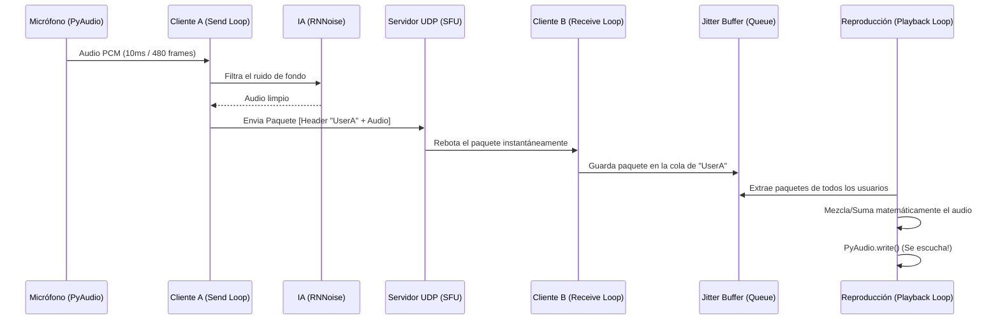

# Arquitectura de Discord Caserito

La aplicación utiliza un modelo **Cliente-Servidor SFU (Selective Forwarding Unit)**. Está diseñada para ser ultraligera, funcionar a nivel local o mediante túneles/IPs públicas, y procesar todo el audio del lado de los clientes para quitarle carga de cómputo al servidor.

A continuación, detallamos cómo está distribuida la lógica a través de los archivos del proyecto.

## 1. Distribución de Archivos

| Archivo | Propósito Principal |
| :--- | :--- |
| **`discord_caserito.py`** | El corazón de la aplicación cliente. Contiene tanto la Interfaz Gráfica (UI) como el Motor de Audio y Red que captura tu micrófono y reproduce las voces. |
| **`sfu/server.py`** | El motor del servidor SFU. Solo recibe paquetes de audio y los rebota a los demás usuarios. **No mezcla el audio ni lo procesa.** |
| **`sfu_server.py`** | El punto de entrada para arrancar el servidor en segundo plano cuando un usuario presiona "Crear Sala (Host)". |
| **`test_sfu_flow.py`** | Script de pruebas automatizadas que simula clientes y verifica que los paquetes UDP viajen correctamente por el SFU. |
| **`test_ui_grid.py`** | Script de pruebas visuales para inyectar "usuarios fantasma" a la interfaz y verificar el Grid estilo Zoom. |
| **`instalar_y_jugar.bat`** | El orquestador de instalación automática de dependencias y Python. |
| **`Abrir Discord.vbs`** | El acceso directo silencioso para iniciar todo de manera transparente. |

---

## 2. Diagrama de Arquitectura de Software

El archivo `discord_caserito.py` está rigurosamente dividido en dos capas totalmente independientes: **Frontend (UI)** y **Backend (AudioEngine)**. 

```mermaid
graph TD
    subgraph UI [Frontend (CustomTkinter)]
        App[VoiceClientApp]
        Grid[ZoomUserGrid]
        Calc[GridCalculator]
        Tiles[ParticipantTile]
        
        App --> Grid
        Grid --> Calc
        Grid --> Tiles
    end

    subgraph Backend [AudioEngine]
        Engine[AudioEngine Class]
        Denoiser[AudioDenoiser]
        
        subgraph Threads [Hilos de Trabajo (Threads)]
            T1(Send Loop)
            T2(Receive Loop)
            T3(Playback Loop)
        end
        
        Engine --> Threads
        T1 --> Denoiser
    end

    UI -- "Inicia/Detiene" --> Backend
    Backend -- "Envía lista de usuarios (Thread-Safe)" --> UI
```

---

## 3. Diagrama de Flujo de Audio (El Viaje del Sonido)

El diseño de la aplicación requiere que el audio se mantenga intacto y rápido. Así es como viaja el audio desde tu micrófono hasta los oídos de tus amigos:



### Detalles Técnicos del Viaje del Audio:
- **Latencia Exacta:** Se lee el micrófono en ráfagas de 10 milisegundos (`CHUNK = 480` a `48000Hz`).
- **Supresión de Ruido Inteligente:** Antes de que el audio salga a internet, la clase `AudioDenoiser` procesa el bloque usando una red neuronal (`pyrnnoise`), que elimina el ruido de estática o del teclado sin afectar la voz.
- **Cabeceras Cero-Carga:** El servidor SFU no procesa nada. Es el propio `AudioEngine` del Cliente A el que le pega un cartel de 16-bytes (Header) al principio del paquete UDP con su nombre de usuario.
- **Mezcla Local Simultánea:** El Cliente B recibe 5 paquetes de 5 personas hablando a la vez. En lugar de trabarse, el `Receive Loop` los guarda en pequeñas colas individuales por usuario (Jitter Buffers). Luego, el `Playback Loop` recoge 1 trozo de cada usuario a la vez, suma matemáticamente las frecuencias de onda en Python, y las manda al parlante al mismo tiempo.
